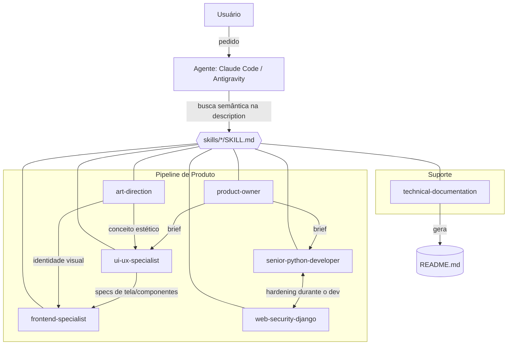

# Documentação Técnica - agents-skills

## Visão Geral

### Objetivo do sistema

Este repositório é uma **coleção de _Agent Skills_** — pastas com instruções no formato
`SKILL.md` que estendem a capacidade de agentes de IA de codificação (Claude Code e Google
Antigravity). Cada skill encapsula o modo de trabalho de um especialista sênior (Product
Owner, UI/UX, Direção de Arte, Frontend, Python, Segurança Django e Documentação Técnica),
de forma que o agente acione automaticamente o especialista certo conforme o pedido do
usuário. O público-alvo são desenvolvedores e times que usam esses agentes e querem
padronizar a qualidade e o processo de entrega entre projetos.

### Stack

- **Formato:** Agent Skills (`SKILL.md` com frontmatter YAML + corpo em Markdown).
- **Agentes-alvo:** Claude Code e Google Antigravity.
- **Linguagem do conteúdo:** Markdown (instruções em português).
- **Sem runtime / build:** não há código executável, dependências ou artefatos compilados;
  o "sistema" é o conjunto de instruções interpretado pelo agente.
- **Ferramentas mencionadas pelas skills:** `uv` (Python), `ruff` (lint), Mermaid (diagramas).

### Arquitetura do sistema

O repositório mantém a pasta `skills/` como **fonte-verdade**; cópias/links em
`.claude/skills/` (e, opcionalmente, `.agents/skills/` no Antigravity) tornam as skills
disponíveis ao agente. Em tempo de execução, o agente lê o campo `description` de cada
`SKILL.md` e, por busca semântica, decide qual skill acionar. As skills se **orquestram
entre si** formando um pipeline de produto.

#### Diagrama



#### Conceitos utilizados

- **Design Patterns**
  - _Strategy / especialistas plugáveis_: cada skill é uma estratégia autocontida acionada
    por contexto.
  - _Orquestração multi-agente_: `product-owner` atua como coordenador que dispara os demais
    especialistas (handoff explícito via brief).
  - _Convention over configuration_: nome da skill = nome da pasta; ativação por `description`.
- **Modelo de arquitetura**
  - Arquitetura **declarativa e baseada em arquivos** (file-based): sem servidor, sem estado;
    o comportamento emerge do conteúdo dos `SKILL.md` lidos pelo agente.
  - **Fonte única + distribuição por cópia/symlink** para escopos de projeto e global.

### Trade-offs

- **Portabilidade vs. recursos específicos de agente:** as instruções são mantidas neutras
  de modelo para funcionar em Claude Code e Antigravity, abrindo mão de otimizações
  específicas de um único agente.
- **Duplicação vs. simplicidade:** copiar skills para `.claude/skills/` é mais simples de
  entender, mas duplica conteúdo; a estratégia de symlink (ver [Instalação do zero](#instalação-do-zero))
  evita duplicação ao custo de configuração inicial.
- **Ativação automática vs. previsibilidade:** confiar na `description` para acionamento
  automático reduz atrito para o usuário, mas exige descrições muito precisas para não
  acionar a skill errada (ou nenhuma).

## Instalação do zero

Não há dependências a instalar nem build a executar — as skills são lidas diretamente pelo
agente. Instalar significa **colocar a pasta da skill no diretório que o agente lê**. O nome
da skill é sempre o **nome da pasta**, que precisa conter o `SKILL.md`.

Comece clonando o repositório:

```bash
git clone https://github.com/paulodneves/agents-skills.git
cd agents-skills
```

#### Anatomia de uma skill

Uma skill é uma **pasta** com, no mínimo, um `SKILL.md` (frontmatter YAML + instruções em
Markdown). Pastas opcionais podem trazer material de apoio:

```
nome-da-skill/
├── SKILL.md          # obrigatório: frontmatter + instruções
├── templates/        # opcional: modelos e arquivos de apoio
├── references/       # opcional: material de contexto
└── scripts/          # opcional: scripts de automação
```

Frontmatter mínimo do `SKILL.md`:

```yaml
---
name: nome-da-skill          # minúsculas e hífens; se omitido, usa o nome da pasta
description: >-              # OBRIGATÓRIO — é o "gatilho" semântico
  Descrição precisa de quando a skill deve ser acionada. Claude Code e Antigravity
  leem este campo por busca semântica para decidir se ativam a skill. Descrição
  vaga = skill nunca acionada.
---
```

O campo **`description` é o mais importante**: é por ele que o agente decide sozinho se a
skill é relevante. O Antigravity aceita ainda campos opcionais úteis em times
(`version`, `author`, `requires: [python3, uv]`) que o Claude Code simplesmente ignora — ou
seja, mantê-los **não quebra a portabilidade**.

#### Instalar no Claude Code

O nome da skill é o nome da pasta que contém o `SKILL.md`. Dois escopos:

- **Projeto específico** — `<raiz-do-projeto>/.claude/skills/<nome>/SKILL.md`. Vale só
  para aquele projeto e pode ser versionado no Git junto do código (recomendado para o time).
  ```bash
  mkdir -p .claude/skills
  cp -r /caminho/para/agents-skills/skills/senior-python-developer .claude/skills/
  ```
- **Global / caminho padrão (todos os projetos)** — `~/.claude/skills/<nome>/SKILL.md`.
  Fica disponível em qualquer projeto na máquina.
  ```bash
  mkdir -p ~/.claude/skills
  cp -r /caminho/para/agents-skills/skills/* ~/.claude/skills/
  ```

> **Precedência:** havendo skill de mesmo nome no projeto e no global, a de **projeto vence**
> — permitindo que um projeto sobrescreva a versão padrão.

Para verificar: no Claude Code, digite `/` para ver as skills disponíveis, ou faça um pedido
que corresponda à `description` — o agente deve acioná-la automaticamente.

#### Instalar no Google Antigravity

Mesmo formato `SKILL.md` e mesma ativação por `description`; muda apenas o diretório.

- **Projeto (workspace)** — `<raiz-do-projeto>/.agents/skills/<nome>/SKILL.md`.
  ```bash
  mkdir -p .agents/skills
  cp -r /caminho/para/agents-skills/skills/web-security-django .agents/skills/
  ```
- **Global / caminho padrão (todos os projetos)** — `~/.gemini/antigravity/skills/<nome>/SKILL.md`.
  ```bash
  mkdir -p ~/.gemini/antigravity/skills
  cp -r /caminho/para/agents-skills/skills/* ~/.gemini/antigravity/skills/
  ```

> ⚠️ **Atenção aos caminhos:** o Antigravity é recente e as fontes públicas divergem quanto
> ao diretório exato (`.agents/skills`, `.agent/skills`, `~/.gemini/antigravity/skills`). Os
> caminhos acima são os **mais citados**; confirme na sua versão em _Settings → Skills_. A
> estratégia de symlink abaixo evita depender disso.

Para verificar: faça um pedido que combine com a `description`, ou mencione a skill
explicitamente (ex.: _"use a skill web-security-django neste projeto"_), e confira a lista em
_Settings → Skills_.

#### Estratégia recomendada: uma fonte, os dois agentes

Para **não duplicar** as skills e manter tudo sincronizado, mantenha a pasta `skills/` como
fonte-verdade e crie **symlinks** para os diretórios que cada agente lê. Assim, `git pull`
neste repositório atualiza os dois agentes de uma vez.

Global (uma vez por máquina, vale para todos os projetos):

```bash
ln -s "$(pwd)/skills" ~/.claude/skills              # Claude Code global
ln -s "$(pwd)/skills" ~/.gemini/antigravity/skills  # Antigravity global
```

Por projeto:

```bash
cd <raiz-do-projeto>
mkdir -p .claude  && ln -s /caminho/para/agents-skills/skills .claude/skills   # Claude Code
mkdir -p .agents  && ln -s /caminho/para/agents-skills/skills .agents/skills   # Antigravity
```

Cross-link (se já tiver as skills em `.claude/skills`, aponte o Antigravity para elas em vez
de manter duas cópias):

```bash
ln -s .claude/skills .agents/skills
```

> Se o diretório de destino já existir, remova/renomeie antes, ou crie os links skill a skill
> (`ln -s .../skills/<nome> ~/.claude/skills/<nome>`). Em symlinks, **use caminho absoluto**.

#### Boas práticas de portabilidade

- **Instruções neutras de modelo:** evite semântica de ferramentas específica de um agente,
  para o mesmo `SKILL.md` rodar nos dois.
- **Capriche na `description`:** é o único gatilho automático — deixe claro _quando_ acionar e
  _quando não_ acionar.
- **Versione as skills de projeto no Git** para padronizar o time.
- **Nomes de pasta em minúsculas com hífens** (ex.: `senior-python-developer`).
- **Global para skills genéricas** (documentação, Python, segurança) e **projeto para skills
  específicas** daquele produto.

## Execução atual

- **Uso diário:** com as skills instaladas, basta fazer um pedido em linguagem natural que
  corresponda à `description` de uma skill; o agente a aciona automaticamente. Também é
  possível invocar explicitamente (ex.: _"use a skill web-security-django neste projeto"_).
- **Precedência:** skills de **projeto** têm prioridade sobre as **globais** de mesmo nome.
- **Atualização:** `git pull` na cópia local; se estiver usando symlink, os agentes passam a
  ver a nova versão imediatamente (caso contrário, recopie as pastas alteradas).
- **Manutenção deste documento:** gerado/atualizado pela própria skill `technical-documentation`.

## Principais Módulos

Cada "módulo" é uma skill em `skills/<nome>/SKILL.md`. As "funções principais" abaixo são as
fases/capacidades públicas de cada skill.

### product-owner

Primeira skill do pipeline de produto: entende o pedido, pesquisa mercado, define escopo e
histórias de usuário, valida suposições com o usuário e compila um _brief_ que aciona as
demais skills.

#### Funções principais
- `Fase 0 — Triagem` — decide se o pedido tem escopo de produto ou é ajuste pontual.
- `Fase 1 — Benchmarking` — pesquisa referências de mercado.
- `Fase 2 — Gap Analysis` — identifica lacunas no pedido.
- `Fase 4 — Histórias de Usuário` — define escopo e pontos de entrega.
- `Fase 6 — Product Brief` — compila e faz handoff para `ui-ux-specialist` e `senior-python-developer`.

### ui-ux-specialist

Especialista de UI/UX acionada quando há qualquer interface gráfica (desktop ou web);
decompõe em telas/fluxos/componentes e define a abordagem de design antes de implementar.

#### Funções principais
- `Fase 0 — Decomposição Atômica` — quebra o pedido em telas e componentes.
- `Fase 1 — Decisão de Abordagem` — heurísticas de usabilidade, acessibilidade, design tokens.
- `Fase 3 — Persistência de Contexto` — grava o plano em arquivo de contexto.
- `Fase 5 — Execução com relatório de progresso` — implementa por tela/componente.

### art-direction

Direção de arte / design conceitual: define personalidade visual, paleta, tipografia e
iconografia antes da implementação, reconciliando com acessibilidade.

#### Funções principais
- `Fase 1 — Moodboard` — pesquisa de referência visual.
- `Fase 2 — Personalidade Visual` — define o tom estético.
- `Fase 3 — Decisões de Direção de Arte` — paleta, tipografia, iconografia, movimento.
- `Fase 4 — Reconciliação com Usabilidade` — ajusta o conceito à acessibilidade.
- `Fase 5 — Handoff` — entrega o conceito para `ui-ux-specialist`/`frontend-specialist`.

### frontend-specialist

Implementação de frontend web (vanilla, HTMX, React, Vue, Alpine, Tailwind, D3), escolhendo
a tecnologia conforme o que o projeto já usa e seguindo specs de UI/UX e direção de arte.

#### Funções principais
- `Fase 1 — Seleção de Tecnologia` — escolhe stack pelo contexto do projeto.
- `Fase 2 — Arquitetura de Componentização` — define componentes reutilizáveis.
- `Fase 5 — Tarefas Rastreáveis` — lista de tarefas por componente.
- `Fase 6 — Execução` — implementa com performance e animações funcionais.

### senior-python-developer

Geração, refatoração e revisão de código Python no padrão sênior; decide a arquitetura
adequada (função simples até Clean/Hexagonal) e executa de forma incremental e rastreável.

#### Funções principais
- `Fase 0 — Decomposição Atômica` — quebra o pedido em subtarefas.
- `Fase 1 — Decisão de Arquitetura` — escolhe entre função simples, SOLID, Clean Architecture.
- `Fase 3 — Persistência de Contexto` — grava o plano antes de codar.
- `Gerenciamento com uv` — fluxo padrão de dependências e execução via `uv`.
- `Fase 5 — Execução` — implementa reportando progresso (ex.: 3/8 tarefas).

### web-security-django

Auditoria e hardening de segurança para projetos Django (Fullstack, DRF, Ninja, HTMX);
atua desde a implementação junto com `senior-python-developer`.

#### Funções principais
- `Fase 0 — Descoberta de Arquitetura` — mapeia o projeto Django.
- `Fase 1 — Auditoria de Segurança` — avalia contra o OWASP Top 10 (prioridade).
- `Fase 2 — Auditoria de Performance` — queries e cache (eixo secundário).
- `Fase 3 — Padronização com Ruff` — lint via `uv`.
- `Fase 4 — Persistência de Relatórios` — grava relatórios de segurança e performance.

### technical-documentation

Gera ou atualiza este documento técnico (`README.md`), seguindo estrutura fixa; trata
geração (do zero) e atualização (diff) como fluxos distintos.

#### Funções principais
- `Passo 1 — Modo` — decide entre geração e atualização.
- `Passo 3 — Investigar o projeto` — levanta stack, arquitetura e módulos reais.
- `Passo 4 — Preencher o template` — inclui diagrama Mermaid e funções por módulo.
- `Passo 5 — Salvar e confirmar` — grava em `README.md` e reporta o que mudou.

## Troubleshooting

Cenário principal:

- Descrição do problema: uma skill nunca é acionada automaticamente pelo agente.
- Evidências e logs: o agente ignora o pedido ou usa comportamento genérico em vez da skill.
- Causa raiz: campo `description` vago/genérico, ou a pasta não está em um caminho lido pelo
  agente (`.claude/skills/`, `~/.claude/skills/`, `.agents/skills/`, `~/.gemini/antigravity/skills/`).
- Solução aplicada: reescrever a `description` deixando claro o gatilho; confirmar que o
  caminho está correto e contém `<nome-da-skill>/SKILL.md`; em symlinks, usar caminho absoluto.

Demais cenários:

| Sintoma | Causa provável | Correção |
|---|---|---|
| Skill nunca é acionada | `description` vaga ou genérica | Reescreva a `description` deixando claro o gatilho |
| Skill não aparece na lista | Caminho errado ou falta o `SKILL.md` | Confira `<dir>/<nome-da-skill>/SKILL.md` |
| Duas versões conflitando | Skill no projeto **e** no global | A de projeto vence; remova a duplicata indesejada |
| Symlink não resolve | Caminho relativo quebrado | Use caminho **absoluto** no `ln -s` |
| Funciona no Claude, não no Antigravity | Caminho global do Antigravity diferente na sua versão | Confirme em _Settings → Skills_ e ajuste o symlink |

### Referências

- [How to Use Antigravity Skills — CloudVyn](https://www.cloudvyn.com/blog/how-to-use-antigravity-skills)
- [Google Antigravity Rules and Agent Skills — RuleSell](https://www.rulesell.com/topic/antigravity-rules)
- [Getting Started with Antigravity Skills — Google Cloud Community](https://medium.com/google-cloud/tutorial-getting-started-with-antigravity-skills-864041811e0d)
- [How to Create Custom Agent Skills for Google Antigravity — SkilLLM](https://skilllm.com/blog/custom-agent-skills-google-antigravity)

## Alterações

| Data | Módulo | Alteração | Motivo |
|------|--------|-----------|--------|
| 2026-08-11 | (repositório) | Criação da documentação técnica (`README.md`) | Documentar objetivo, arquitetura, pipeline de skills e instalação em Claude Code e Antigravity |
| 2026-08-11 | Instalação / Troubleshooting | Guia de instalação (anatomia da skill, caminhos por projeto e global, symlink, boas práticas e tabela de troubleshooting) consolidado no `README.md` | `docs/GUIA-INSTALACAO-SKILLS.md` foi removido; todo o conteúdo passou a viver em um único arquivo |
| 2026-08-12 | technical-documentation | Removida a skill duplicada `tdoc`; documentação técnica passa a ser gerada apenas pela skill `technical-documentation` | Eliminar redundância — as duas skills faziam a mesma coisa; `technical-documentation` já cobre os gatilhos "tdoc"/"tecdoc" na sua `description` |
